# JavaScript Basics and Essentials

## Everything in JS happens inside an `Execution Context`

- Assume it to be a box of two columns namely, Memory and Code.
  | Memory | Code |
  |--------|------|
  |key : value| Code Line 1|
  |key1 : value1| Code Line 2|

So, in the memory component, all the variables and functions are stored like key-value pairs. Memory component is also called Variable Environment.

In the code component, the code is executed one line at a time one by one, which is also known as thread of execution.

## JS is a synchronous single threaded language.

- Single Threaded and synchronous: It can execute only one command at a time(single threaded), in a specific order, i.e, after the line is done executing(synchronous) then only it moves onto the next one.

## How JS code is executed?

- We have a Global Execution Context, and for each function call its own execution context is created.

- Consider this code snippet, let us run the code as JS would.

```js
1. var n = 2;
2. function square(num) {
3.      var ans = num * num;
4.      return ans;
5. }
6. var square2 = square(n);
7. var square4 = square(4);
```

- The Global Execution Context(GEC) is created in two phases.

  1. Memory Creation Phase
  2. Code Execution Phase

- Phase 1: Memory Creation

| Memory                            | Code |
| --------------------------------- | ---- |
| n : undefined                     |      |
| square : {...whole function body} |      |
| square2 : undefined               |      |
| sqaure4 : undefined               |      |

- Phase 2: Code Execution

1. Line 1 runs and assigns n = 2.
2. Line 2 to 5 is skipped as there's nothing to execute.
3. Line 6 runs and creates a Execution Context as there's a function call. Let's have a look at the call stack right now.

- Phase 1: Memory creation for the function's context
  | Memory | Code |
  | --------------------------------- | -------------------------------------------------------------------------------------------------------------------- |
  | n : 2 | <table><tr><th>Memory</th><th>Code</th></tr><tr><td>num: undefined</td><tr><td>ans: undefined</td></tr></tr></table> |
  | square : {...whole function body} | |
  | square2 : undefined | |
  | sqaure4 : undefined | |

4. After this same thing happens as it happened in the code execution phase for GEC, i.e, `the value num is assigned to be n from GEC as the function parameter takes n`, then `n becomes 2` in code execution phase and then, ans is assigned to be 4.

- Phase 2: Code Execution in the function's context
  | Memory | Code |
  | --------------------------------- | --------------------------------------------------------------------------------------------------------------------------------------------- |
  | n : 2 | <table><tr><th>Memory</th><th>Code</th></tr><tr><td>num: 2</td><td>num\*num &larr; executes</td><tr><td>ans: undefined</td></tr></tr></table> |
  | square : {...whole function body} | |
  | square2 : undefined | |
  | sqaure4 : undefined | |
- Ongoing Phase 2:
  | Memory | Code |
  | --------------------------------- | ---------------------------------------------------------------------------------------------------- |
  | n : 2 | <table><tr><th>Memory</th><th>Code</th></tr><tr><td>num: 2</td><tr><td>ans: 4</td></tr></tr></table> |
  | square : {...whole function body} | |
  | square2 : undefined | |
  | sqaure4 : undefined | |

      When the `return statement` is encountered the return value is returned ofcourse along with it the control is also returned back to the line in GEC wherever it was called from, i.e, line 6 in this case and sqaure2 is assigned to be 4.

- Ongoing Phase 2:
  | Memory | Code |
  | --------------------------------- | --------------------------------------------------------------------------------------------------------------------------------------- |
  | n : 2 | <table><tr><th>Memory</th><th>Code</th></tr><tr><td>num: 2</td><td>return ans &larr; executes</td><tr><td>ans: 4</td></tr></tr></table> |
  | square : {...whole function body} | |
  | square2 : undefined | |
  | sqaure4 : undefined | |

      Then that local execution context is deleted as the function execution was eventually complete.

- Execution Context for the function got deleted:
  | Memory | Code |
  | --------------------------------- | ---- |
  | n : 2 | |
  | square : {...whole function body} | |
  | square2 : 4 | |
  | sqaure4 : undefined | |

5. Same thing happens for sqaure(4) function call, this time instead of n, in the code execution phase, 4 is directly assigned.

## Call Stack maintains the order of execution of execution Contexts.

- `It stores GEC at its bottom, then the EC for square(n) function call, after that's done, it pops it off once its returned and then again puts in the EC of the second function call, i.e., sqaure(4) and pops it off once its done executing and finally pops off GEC from the stack.`

- This is how JS Engine manages the creation and deletion of Execution Contexts efficiently and keeps track of the order of the execution contexts.
- Also known as Execution Context Stack, Program Stack, Control Stack, Runtime Stack and Machine Stack, all of the same are the same thing- THE CALL STACK.

## [Hoisting in JS](/hoistingInJS/index.js)

- Formal Definition: In JavaScript, hoisting is a mechanism where variable and function declarations are moved to the top of their scope (either global or function scope) during the compilation phase, before the code is executed. This means you can use variables and functions before they are declared in the code.

```js
getName(); // this prints Hello ofcourse
console.log(x); // this prints undefined

console.log(getName);
/* 
    Output of above statement: Even before we define the function we get the body, why?
    ƒ getName() {
    console.log("Hello");

    Because of the memory creation phase.
}
*/

var x = 7;
function getName() {
  console.log("Hello");
}

getName(); // this prints Hello
console.log(x); // this prints 7

// but if we remove the statement var x = 7, then we'll see an error in the console saying that
// x is not defined, which is NOT THE SAME AS undefined.

console.log(getName);
/* 
    Output of above statement:
    ƒ getName() {
    console.log("Hello");
}
*/

someFn(); // gives error that someFn is not a function
/* 
Because during the memory creation phase it was treated as avariable because of var
and was assigned the value undefined.
*/

var someFn = () => {
  console.log("Just some fun!");
};
```

1. Firstly, the GEC comes into the picture then the memory creation phase starts.

2. What really happens is that during the memory creation phase all the variables and functions are assigned/allocated memory, where the variables of type var are set as undefined and the function body is moved in the GEC.

3. Then, when the code is executed, and if we try to access the variable even before the definition/declaration, we get undefined because it was assigned undefined in the memory creation phase, and the functions work properly as they were put in the GEC before in the memory creation phase only.

4. However, if we declare arrow functions using the var keyword, the function will be assinged undefined in the memory as it is treated as a variable and not a function, even if we use the anonymous function and assign it to a var, it will be treated as a variable only, that's why if we try to call that function it'll give us an error that getName is not a function as it is being treated as a variable and NOT a function.

### Call Stack in this scenario

1. The GEC will be loaded as the name (anonymous).
2. Then when the Execution Context of getName() is creates upon its function call, it's pushed into the stack and is popped off once the function execution completes.

## [Functions in JS](functions/index.js)

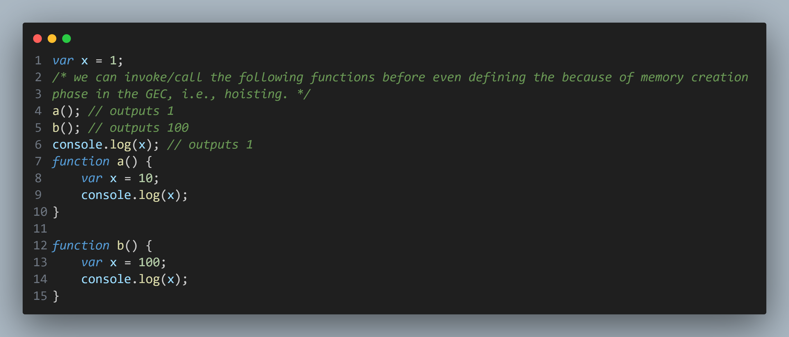

Let's dive deep into the outputs and how is the code working!

Phase 1: Memory Creation - In the memory block

    x : undefined
    a : {... function code}
    b : {... function code}

Call Stack:
| |
|-|
|GEC|

Phase 2: Code Execution

Memory Block:

    x:1
    a:{...}
    b:{...}

Code Block:

    var x = 1; <- assigns 1 to x in GEC
    a(); -> function 'a' is invoked which creates another EC, with the parameters(none in this case) and the variables inside the function. This EC is independent of everything.
    And also, it will be pushed onto the call stack.

Call Stack:
| |
|-|
|a|
|GEC|

Phase 1: Memory creation

    x : undefined

Phase 2: Code Execution

    var x = 10 runs and x is assgined 10 in memory.
    console.log(x) runs and prints 10.
    Function execution completes.
    Control is returned to line 2, i.e., GEC, then a's EC is popped off the stack and the EC is deleted.
    Call Stack:
        |GEC|

Same happens with b() and then when the program is finished executing the GEC is popped off the stack and the GEC is deleted.

## [Global Scope, This Keyword and Window Object](windowAndThisKeyword/index.js)

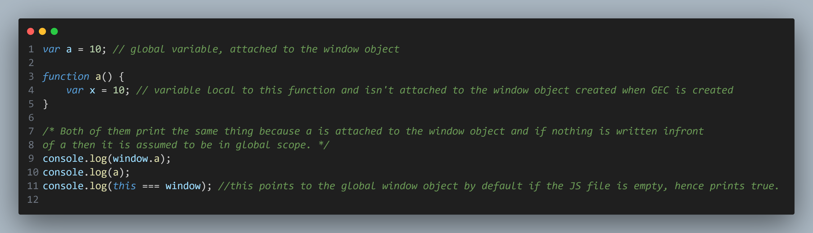

1. Even in an empty JS file, a global window object is created with a lot of properties inside along with the ones that are defined in the global
   scope.
   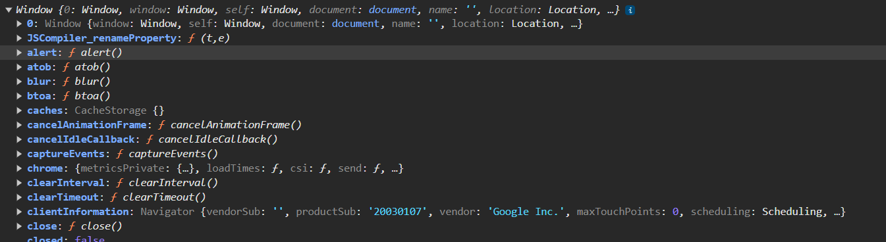
2. What is global scope?

   Ans. If a function/variable is defined outside any function's scope it is considered to be global and is attached
   to the window object.

3. `This` keyword is intialized with the global window object and points to it.
4. Obviously, in an empty JS file there's just the Memory Creation Phase and GEC is popped off in the Code Execution
   Phase as there's no code to run!

## Undefined vs Not Defined


- Undefined: A placeholder until a variable is assigned some value, if its not assigned any value throughout the program it will remain undefined.
- Not Defined: The variable hasn't even been declared in the file hence doesn't exist in the Memory Space itself!
- Weak/Loose Typing: The types of a variable could be changed as JS doesn't associate a variable to any kind of types.
- One should avoid assigning undefined to the variables in a program as the keyword is used as more of a placeholder.

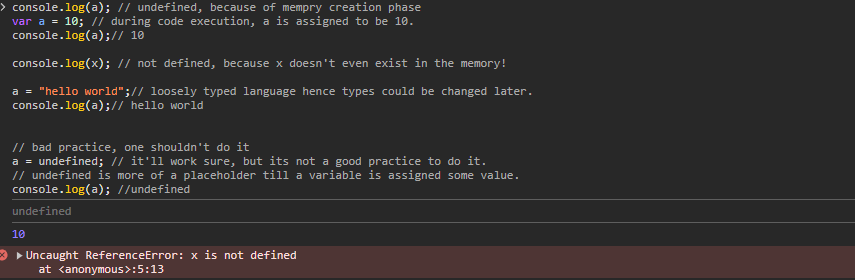

As we can see the program would terminate if a variable which hasn't even been declared is encountered.

## Scope, Scope Chain and Lexical Environment

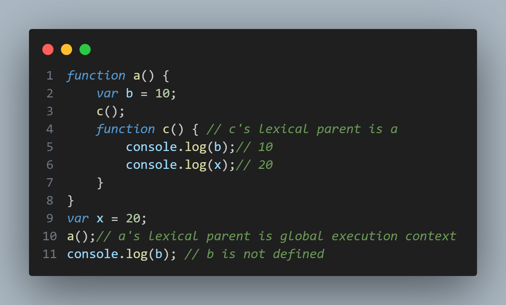

- Scope: The extent till which a variable is accessible. It depends on the context as well.

- Lexical: relating to

  So when we say lexical environment, we mean the scope around a function, like in case of c it's a, in case of a it's the global scope and in case of global it's null.

- Now, the scope chain is nothing but a derivation from the following concept:

  - Whenever an EC is created, it has the reference to it's local scope, i.e., to the variables and functions defined inside it and the reference of parent lexical environment.

  - In case of x, when `console.log(x)` is executed inside the function c, then it firstly searches inside the local scope, then in the parent lexical environment it has access to, i.e., a and then goes back to the parent lexical environment of a(as a has accesss to its parent same as c) which is global scope in this case hence printing 20.

  - Although, in case of `console.log(b)` at line 11, it doesn't find the variable declaration in its scope which is global and there's no parent to global scope so it prints an error which is `b is not defined`.

  - In the call stack, we can easily trace back the parent lexical environment as we traverse from top to the bottom of the stack.

  - Lexical environment = Local Scope + Reference to the lexical parent's scope/lexical environment

And this is how a scope chain is formed which traces back till the Global Context.

## [let and const in JS: They behave like variable declarations should.](hoistingInJS/index.js)

- From now on, never use 'var'.

- They do `block scoped variable declaration`.

- These `cannot be accessed before initialization`, it'll become clear later.

- They `aren't attached to the window/global object` unlike variables declared with var.

- `Values of const variables can't be changed, they need to be declared and initialized at the same time. It gives out Syntax Error if we don't initialize it.`

- `They cannot be redeclared. It's a Syntax Error and the whole file won't even execute.`

- `Are they hoisted? Yes, they are!`

### Hoisting of let and const variables

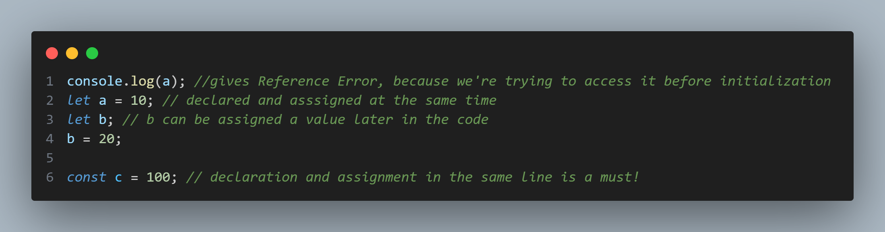

1. During the memory creation phase these declarations exist in what's called a `temporal dead zone`, it could be `found under Script scope` if checked in the browser.

2. During the time between the execution of code and them being actually assigned a value they exist in the temporal dead zone with the placeholder undefined but aren't accessible yet.

3. Only once they are `assigned a value during the code execution phase`, which could be undefined for let variables if the let variable wasn't assigned anything explicitly in the code, `they become accessible`.

4. If we `try to access them before hand we get the Reference Error`, i.e., `they cannot be accessed before initialization`. Program stops executing further ofc.

- Syntax Errors aren't tolerated and the whole JS file won't even execute.
- In case of TypeError or Reference Error, the file will run until we get the error and then the execution will stop.

- Order of usage: const &rarr; let &rarr; var(never use this)

## Block Scope and Shadowing

Q. What is a block?

- It is also known as compound statement, i.e., combining multiple JS statements into a group.

- Following is called a block and each block has a scope, which starts from the starting curly bracket and ends at the closing curly bracket.

      {

      }

Example:

```js
if (true) {
  // Compound statement
  let a = 10;
  console.log(a);
}
```

- if expects one statement after it's declared but what if we we want to execute multiple statements? That's when we need a block to wrap up all the statements into one block.

- Whatever we can access inside the block comes into its scope.

- Every time a block scope is defined then JS makes a new block scope each time and variables are defined for each block therefore we can say that JS runs block by block.

- These let variables will be defined into what's called a Block Scope and not the Script scope. If we define a let or const variable outside(globally) it would be defined in the Script Scope.

```js
{
  var l = 100;
  let a = 10;
  const b = 20;
}
{
  let c = 10;
  const d = 20;
}

console.log(l); // 100
console.log(a); // gives Error that a is not defined
console.log(b); // gives Error that b is not defined
```

### Shadowing

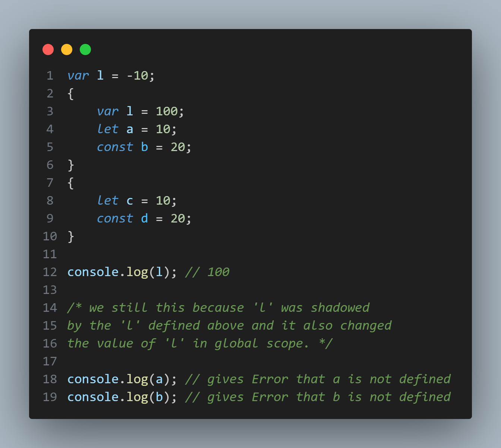

#### But in case of let and const:

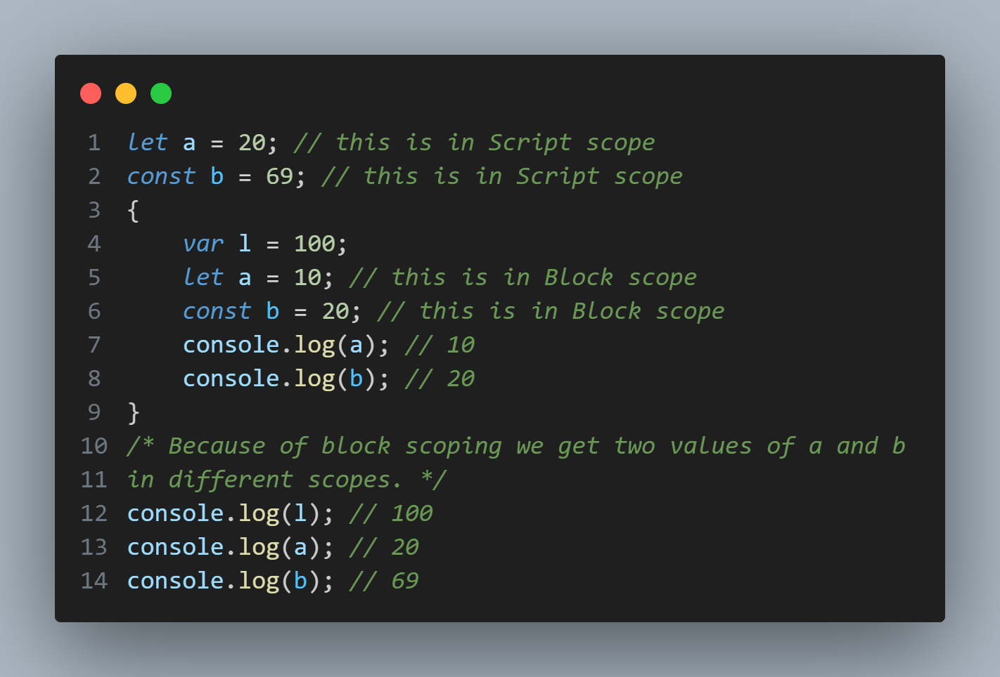

- Even in the case of function scopes we get the same result.
- Illegal Shadowing: A 'let' cannot be shadowed by 'var', but the opposite is true. Reason: Because the scope of 'var' is global and of 'let' is block/script so in this case it crosses its scope and violates 'let'. Just think of scope like an arrow going down the program from the point of declaration except in case of 'var' it always starts from the top, no matter wherever it's defined.

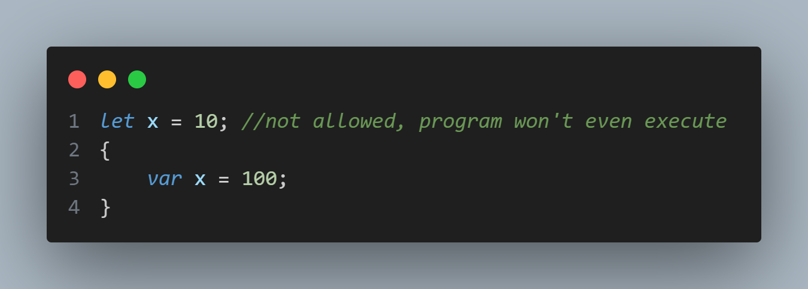

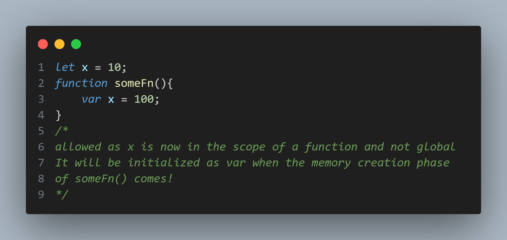

- However, we can shadow `let` with `let`, `const` with `const`, `const` with `let` and vice-versa too and blocks also have lexical environments as such:


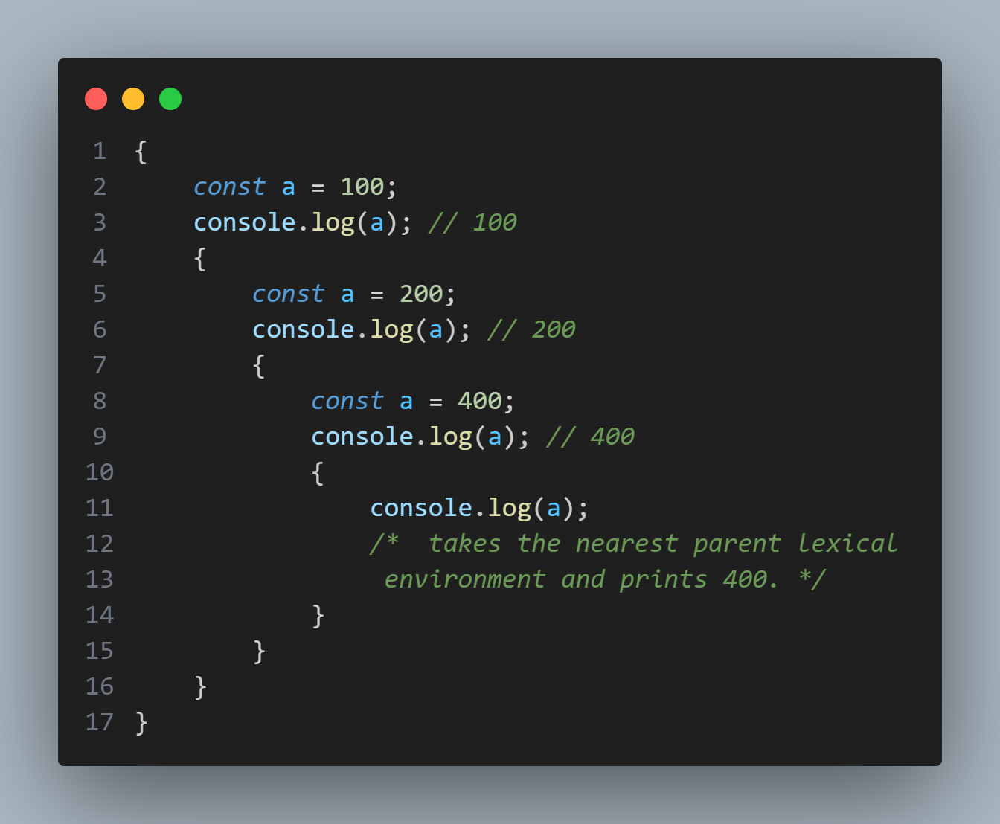

## Closures: Bundle of Lexical Scope of a function + itself

- When a function is returned from another function `it rememebers the enclosed(lexical) scope` along with the function which is being returned. So basically a closure is returned, instead of just the function code.

- You can think of it like this: When you call that inner function, you just simply go to that actual place of declaration and execute the function as if it was called from it's place of declaration only.

- `Closures remember the scope they were created in, which allows access to variables even after the outer function has returned.`


### Some nitty-gritties about closures

- When the function is returned, it remembers the lexical scope as well as it takes care of the references of the variables in Memory and they aren't garbage collected, they are retained, hence a became 100 in the following example.

  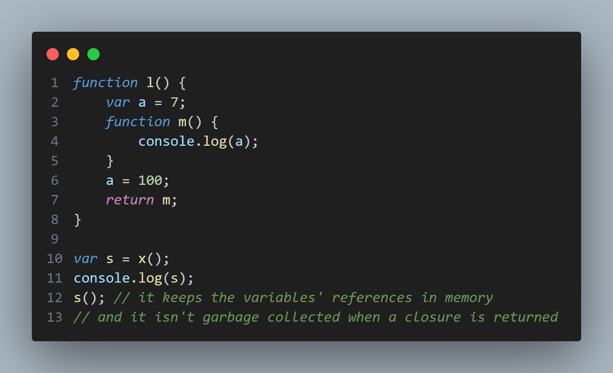

- If we have one level deeper nesting, then also it gives us the variable's value, no need to worry, we have seen it in the example of x,y and z functions above.

### Some use cases of Closures

1. Module Design Pattern
2. Currying in JS
3. Memoize
4. Functions like once
5. Maintaining state in the `async` world
6. Iterators
7. Set Timeouts and many more...!

### Disadvantages of Closures

- Takes too much memory
- Could lead to memory leaks which would freeze the browser

### SetTimeout and Closures

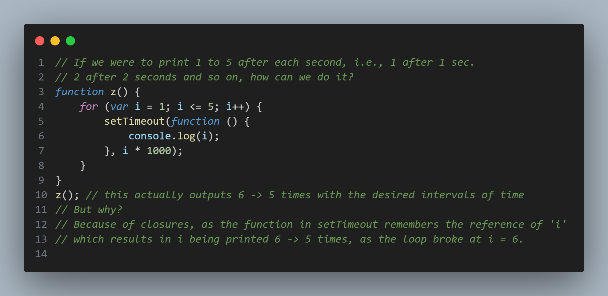

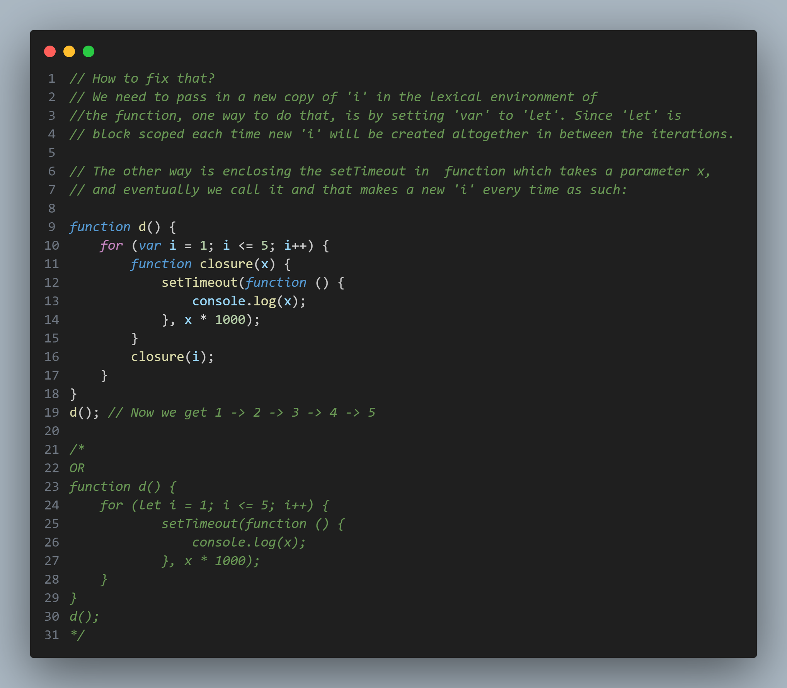

## [First Class Function](./firstClassFunctions/index.js)

- The ability of functions to be used as values, returned as values or be passed as an argument into another function is known as first class functions in JS.
  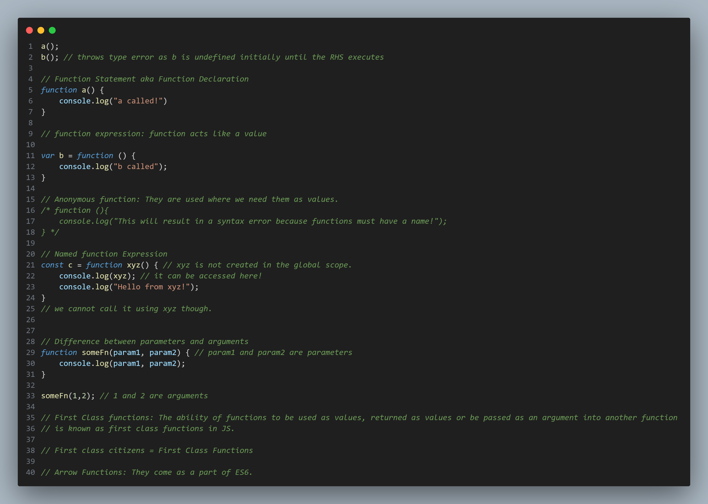

## [CallBack Functions](./callbackFunctions/index.js)

- Functions taken as input by another function as a parameter are known as Callback functions.
  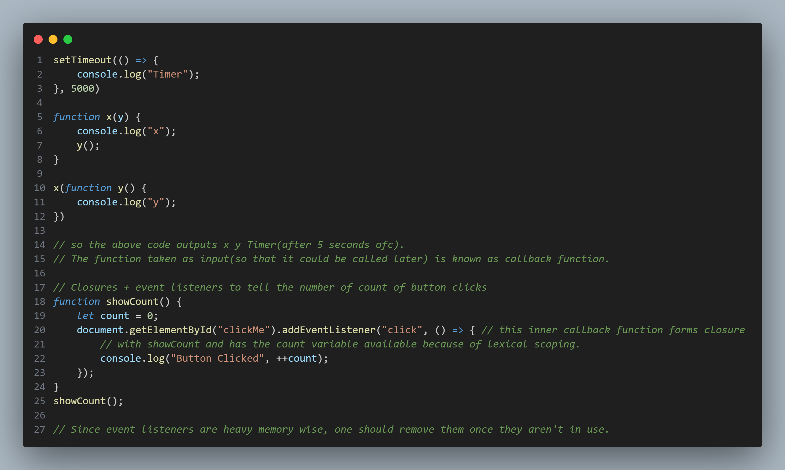

## [Asynchronous JS and Event Loop](./asynchronousJSAndEventLoop//index.js)

#### All of the code in JS runs in Call Stack only!

!!! In Call Stack `GEC` is the first thing which is pushed, because remember Call stack helps us to keep track of Execution Contexts !!!

- Browser Model:
  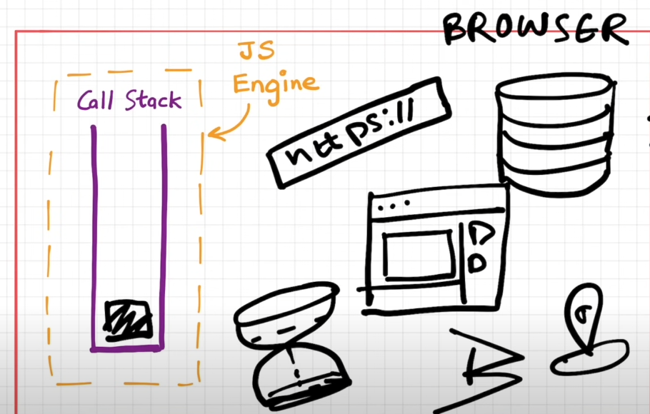

- Some Web APIs:
  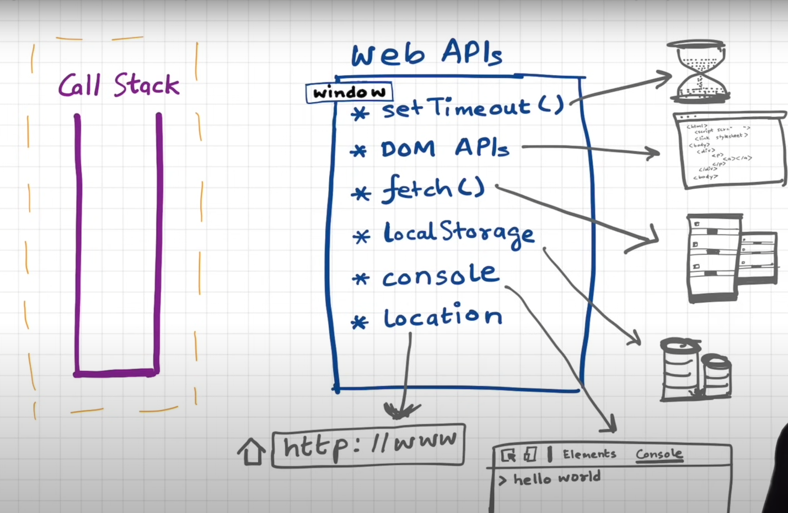
  1. setTimeout()
  2. DOM APIs
  3. fetch()
  4. localStorage
  5. console
  6. location

### Global Object = window

Ex: window.setTimeout(), window.fetch() etc, gives us the access to the Web APIs.

Since window is a global object we don't explicitly need to write the window.something.

- Set Timeout Running

```js
console.log("start");
setTimeout(() => {
  console.log("Hello");
}, 5000);
console.log("End");
```

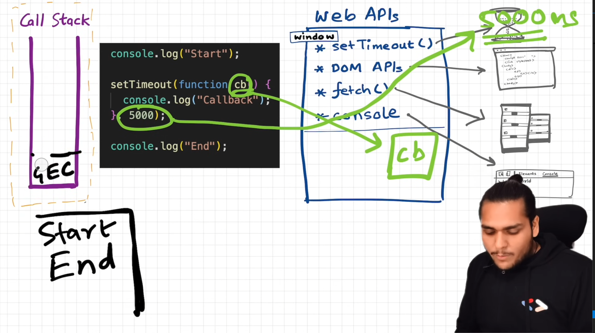

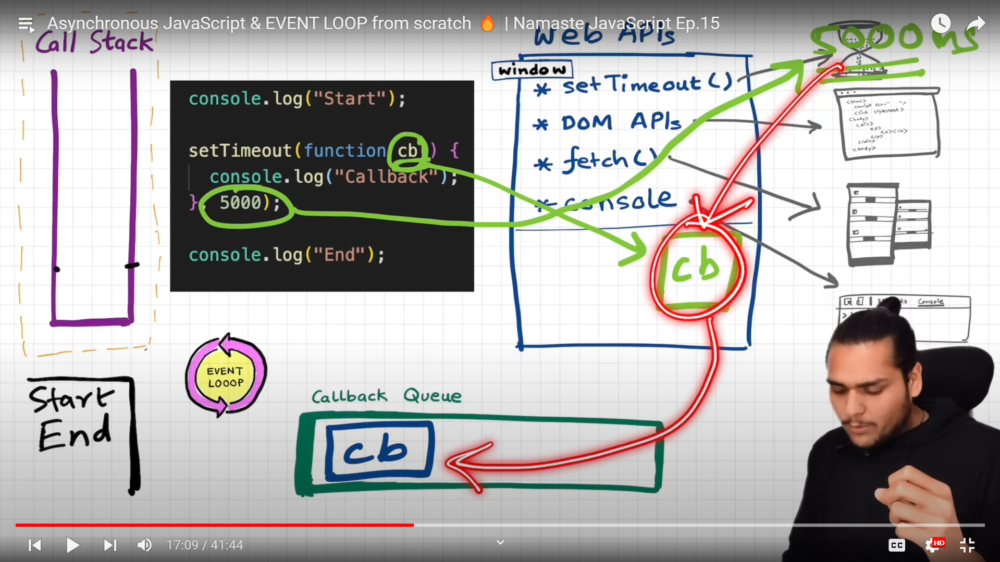

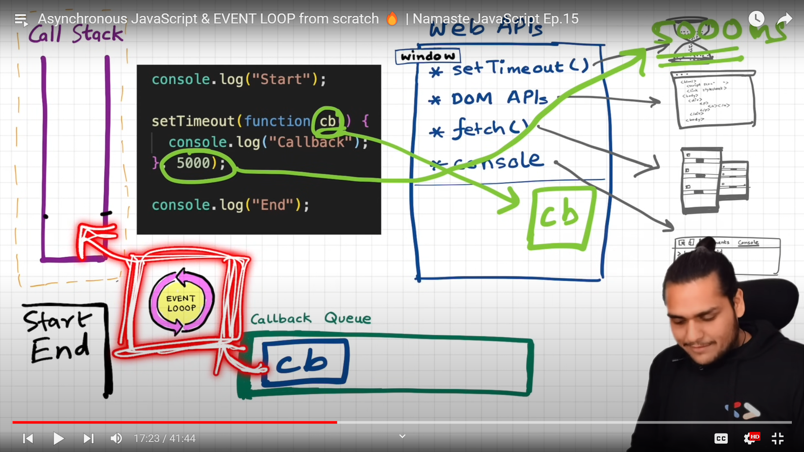

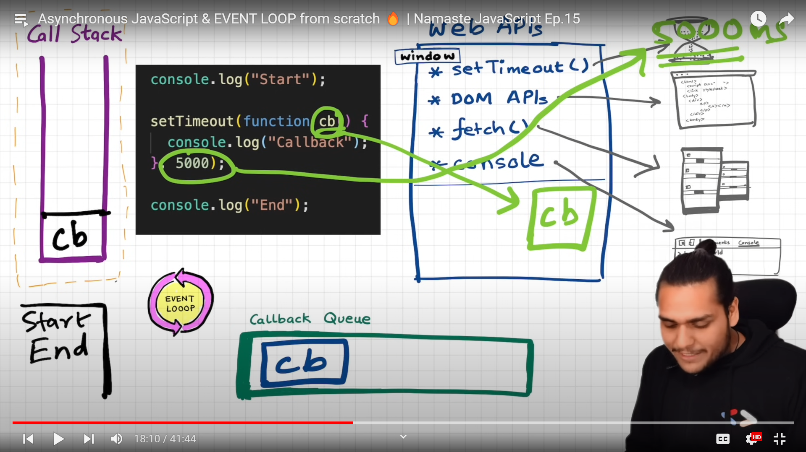

- Explanation:

#### 1. Memory Creation Phase (Global Execution Context)

- Variables like `setTimeout`, `console`, and functions are stored in memory.
- The setTimeout function is recognized as part of the Browser API (Web API).

#### 2. Code Execution Phase (Global Context)

- `console.log("start")`: Printed immediately to the console.

- `setTimeout` API:

  - `setTimeout` is called, and a timer starts (set for 5000ms or 5 seconds).
  - The callback function is passed to the Web API (Browser Timer).
  - Code execution continues without waiting for the timer.

- `console.log("End")`: Printed immediately, right after the setTimeout.

#### 3. Timer Expiration (After 5 seconds)

- The Web API completes the timer.
- The callback function `() => { console.log("Hello"); }` is pushed to the Callback Queue.

#### 4. Event Loop

- Once the call stack is empty (i.e., after `console.log("End")`), the Event Loop moves the callback from the Callback Queue to the Call Stack.

#### 5. Callback Execution

- The callback is executed: `console.log("Hello")` is printed.
- Thus, the sequence in the console is:

  "start"

  "End"

  (After 5 seconds) "Hello"

Read: [Async in JS Deep Dive](./asynchronousJSAndEventLoop/README.md)

## [setTimeout Deep Dive](./setTimeoutDeepDive/index.js)

- Remember: GEC get's popped off when the callback functions of Web APIs run as they run only after synchronous functions finish execution.

```js
console.log("start");

setTimeout(() => {
  // setTimeout guarantees atleast 5 seconds of the callback function running
  console.log("Callback, runs in atleast 10 seconds.");
}, 5000);

const startDate = new Date().getTime();
let endDate = startDate + 10_000;
while (new Date().getTime() < endDate); // runs for 10 seconds

console.log("End");
```

```js
setTimeout(() => {
  console.log("Runs in atleast 0 seconds.");
}, 0);

// setTimeout will always be sent to the Web APIs then the timer of even 0s will be set and it'll go to the callback queue and then
// it comes to the call stack
```

## [Higher Order function](./higherOrderFunctions/index.js)

- A function which takes a function as a parameter or returns a function is known as a higher order function.

```js
const radii = [3, 1, 2, 4];

function calculateArea(radii) {
  return radii.map((radius) => Math.PI * radius * radius);
}

console.log(calculateArea(radii));

const calculateCircumference = (radii) => {
  return radii.map((radius) => Math.PI * 2 * radius);
};

console.log(calculateCircumference(radii));

// Now the above way isn't the best way to write proper code and could be optimized to use higher order functions!
// We'll try to write modular code, and follow the DRY principle.
```

- We should write a generic function in which we can simply pass functions(logic) and then use it for various purposes.
- The better way to write modular code using Higher Order Functions:

```js
function calculate(radii, logic) {
  // now this function does one job only: apply the logic to each element and then return an array
  const output = []; // output array which will be returned from this calculate higher order function
  for (let i = 0; i < radii.length; i++) {
    output.push(logic(radii[i])); // simply apply the logic and push into the output array
  }

  return output;
}

const area = (radius) => {
  return Math.PI * radius * radius;
};

const areas = calculate(radii, area);
console.log(areas);

// We can re-use the calculate function for various logics
const diameter = (radius) => {
  return 2 * radius;
};

const circumference = (radius) => {
  return 2 * Math.PI * radius;
};

console.log(calculate(radii, diameter));
console.log(calculate(radii, circumference));
```

- To use the function like this: radii.calculate(logic) &rarr; use Array.prototype.fn

```js
Array.prototype.calculate = function (logic) {
  const output = [];
  for (let i = 0; i < this.length; i++) {
    output.push(logic(this[i]));
  }
  return output;
};

console.log(radii.calculate(area));
```
