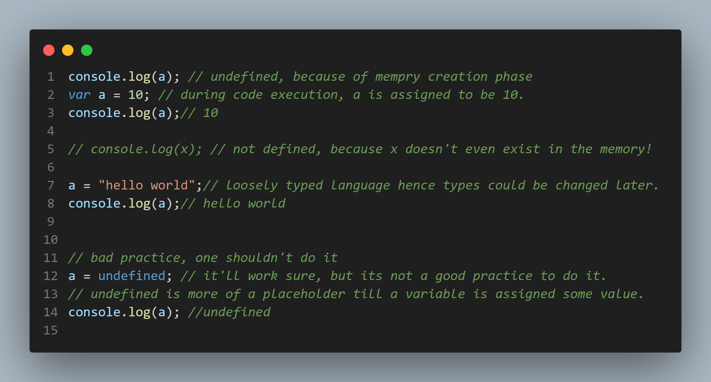
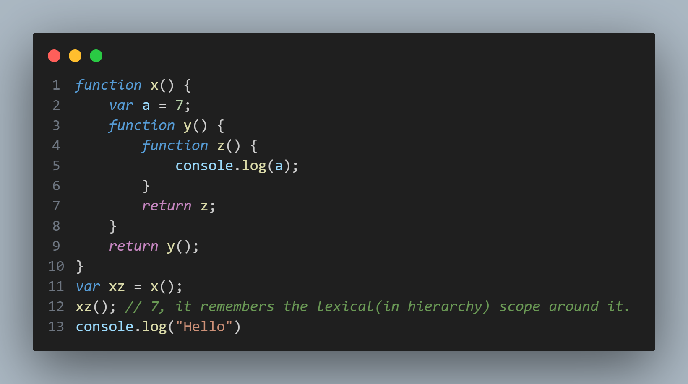

# JavaScript Basics and Essentials

## Everything in JS happens inside an `Execution Context`

- Assume it to be a box of two columns namely, Memory and Code.
  | Memory | Code |
  |--------|------|
  |key : value| Code Line 1|
  |key1 : value1| Code Line 2|

So, in the memory component, all the variables and functions are stored like key-value pairs. Memory component is also called Variable Environment.

In the code component, the code is executed one line at a time one by one, which is also known as thread of execution.

## JS is a synchronous single threaded language.

- Single Threaded and synchronous: It can execute only one command at a time(single threaded), in a specific order, i.e, after the line is done executing(synchronous) then only it moves onto the next one.

## How JS code is executed?

- We have a Global Execution Context, and for each function call its own execution context is created.

- Consider this code snippet, let us run the code as JS would.

```js
1. var n = 2;
2. function square(num) {
3.      var ans = num * num;
4.      return ans;
5. }
6. var square2 = square(n);
7. var square4 = square(4);
```

- The Global Execution Context(GEC) is created in two phases.

  1. Memory Creation Phase
  2. Code Execution Phase

- Phase 1: Memory Creation

| Memory                            | Code |
| --------------------------------- | ---- |
| n : undefined                     |      |
| square : {...whole function body} |      |
| square2 : undefined               |      |
| sqaure4 : undefined               |      |

- Phase 2: Code Execution

1. Line 1 runs and assigns n = 2.
2. Line 2 to 5 is skipped as there's nothing to execute.
3. Line 6 runs and creates a Execution Context as there's a function call. Let's have a look at the call stack right now.

- Phase 1: Memory creation for the function's context
  | Memory | Code |
  | --------------------------------- | -------------------------------------------------------------------------------------------------------------------- |
  | n : 2 | <table><tr><th>Memory</th><th>Code</th></tr><tr><td>num: undefined</td><tr><td>ans: undefined</td></tr></tr></table> |
  | square : {...whole function body} | |
  | square2 : undefined | |
  | sqaure4 : undefined | |

4. After this same thing happens as it happened in the code execution phase for GEC, i.e, `the value num is assigned to be n from GEC as the function parameter takes n`, then `n becomes 2` in code execution phase and then, ans is assigned to be 4.

- Phase 2: Code Execution in the function's context
  | Memory | Code |
  | --------------------------------- | --------------------------------------------------------------------------------------------------------------------------------------------- |
  | n : 2 | <table><tr><th>Memory</th><th>Code</th></tr><tr><td>num: 2</td><td>num\*num &larr; executes</td><tr><td>ans: undefined</td></tr></tr></table> |
  | square : {...whole function body} | |
  | square2 : undefined | |
  | sqaure4 : undefined | |
- Ongoing Phase 2:
  | Memory | Code |
  | --------------------------------- | ---------------------------------------------------------------------------------------------------- |
  | n : 2 | <table><tr><th>Memory</th><th>Code</th></tr><tr><td>num: 2</td><tr><td>ans: 4</td></tr></tr></table> |
  | square : {...whole function body} | |
  | square2 : undefined | |
  | sqaure4 : undefined | |

      When the `return statement` is encountered the return value is returned ofcourse along with it the control is also returned back to the line in GEC wherever it was called from, i.e, line 6 in this case and sqaure2 is assigned to be 4.

- Ongoing Phase 2:
  | Memory | Code |
  | --------------------------------- | --------------------------------------------------------------------------------------------------------------------------------------- |
  | n : 2 | <table><tr><th>Memory</th><th>Code</th></tr><tr><td>num: 2</td><td>return ans &larr; executes</td><tr><td>ans: 4</td></tr></tr></table> |
  | square : {...whole function body} | |
  | square2 : undefined | |
  | sqaure4 : undefined | |

      Then that local execution context is deleted as the function execution was eventually complete.

- Execution Context for the function got deleted:
  | Memory | Code |
  | --------------------------------- | ---- |
  | n : 2 | |
  | square : {...whole function body} | |
  | square2 : 4 | |
  | sqaure4 : undefined | |

5. Same thing happens for sqaure(4) function call, this time instead of n, in the code execution phase, 4 is directly assigned.

## Call Stack maintains the order of execution of execution Contexts.

- `It stores GEC at its bottom, then the EC for square(n) function call, after that's done, it pops it off once its returned and then again puts in the EC of the second function call, i.e., square(4) and pops it off once its done executing and finally pops off GEC from the stack.`

- This is how JS Engine manages the creation and deletion of Execution Contexts efficiently and keeps track of the order of the execution contexts.
- Also known as Execution Context Stack, Program Stack, Control Stack, Runtime Stack and Machine Stack, all of the same are the same thing - THE CALL STACK.

## [Hoisting in JS](/hoistingInJS/index.js)

- Formal Definition: In JavaScript, hoisting is a mechanism where `variable and function(even async ones, if declared witha function keyword) declarations are moved to the top of their scope (either global or function scope) during the compilation phase, before the code is executed.` This means you can use variables and functions before they are declared in the code.

```js
getName(); // this prints Hello ofcourse
console.log(x); // this prints undefined

console.log(getName);
/* 
    Output of above statement: Even before we define the function we get the body, why?
    ƒ getName() {
    console.log("Hello");

    Because of the memory creation phase.
}
*/

var x = 7;
function getName() {
  console.log("Hello");
}

getName(); // this prints Hello
console.log(x); // this prints 7

// but if we remove the statement var x = 7, then we'll see an error in the console saying that
// x is not defined, which is NOT THE SAME AS undefined.

console.log(getName);
/* 
    Output of above statement:
    ƒ getName() {
    console.log("Hello");
}
*/

someFn(); // gives error that someFn is not a function
/* 
Because during the memory creation phase it was treated as avariable because of var
and was assigned the value undefined.
*/

var someFn = () => {
  console.log("Just some fun!");
};
```

1. Firstly, the GEC comes into the picture then the memory creation phase starts.

2. What really happens is that during the memory creation phase all the variables and functions(NOT callbacks!) are assigned/allocated memory, where the variables of type var are set as undefined and the function body is moved in the GEC.

3. Then, when the code is executed, and if we try to access the variable(`var` type obviously) even before the definition/declaration, we get undefined because it was assigned undefined in the memory creation phase, and the functions work properly as they were put in the GEC before in the memory creation phase only.

4. However, if we declare arrow functions using the `var` keyword, the function will be assigned `undefined` in the memory as it is treated as a variable and not a function(since JS doesn't know if it's a function yet!), even if we use the anonymous function and assign it to a var, it will be treated as a variable only, that's why if we try to call that function it'll give us an error that `getName is not a function` as it is being treated as a variable and NOT a function.

- Callbacks(functions which are passed as parameters to other functions, it'll be discussed later) aren't registered in the memory during the `Memory Creation/Hoisting` Phase, it is `registered only during the Code Execution Phase`.

### Call Stack in this scenario

1. The GEC will be loaded as the name (anonymous).
2. Then when the Execution Context of getName() is creates upon its function call, it's pushed into the stack and is popped off once the function execution completes.

## [Functions in JS](functions/index.js)


Let's dive deep into the outputs and how is the code working!

Phase 1: Memory Creation - In the memory block

    x : undefined
    a : {... function code}
    b : {... function code}

Call Stack:
| |
|-|
|GEC|

Phase 2: Code Execution

Memory Block:

    x:1
    a:{...}
    b:{...}

Code Block:

    var x = 1; <- assigns 1 to x in GEC
    a(); -> function 'a' is invoked which creates another EC, with the parameters(none in this case) and the variables inside the function. This EC is independent of everything.
    And also, it will be pushed onto the call stack.

Call Stack:
| |
|-|
|a|
|GEC|

Phase 1: Memory creation

    x : undefined

Phase 2: Code Execution

    var x = 10 runs and x is assgined 10 in memory.
    console.log(x) runs and prints 10.
    Function execution completes.
    Control is returned to line 2, i.e., GEC, then a's EC is popped off the stack and the EC is deleted.
    Call Stack:
        |GEC|

Same happens with b() and then when the program is finished executing the GEC is popped off the stack and the GEC is deleted.

## [Global Scope, This Keyword and Window Object](windowAndThisKeyword/index.js)


1. Even in an empty JS file, a global window object is created with a lot of properties inside along with the ones that are defined in the global
   scope.
   
2. What is global scope?

   Ans. If a function/variable is defined outside any function's scope it is considered to be global and is attached
   to the window object.

3. `This` keyword is intialized with the global window object and points to it.
4. Obviously, in an empty JS file there's just the Memory Creation Phase and GEC is popped off in the Code Execution
   Phase as there's no code to run!

## Undefined vs Not Defined



- Undefined: A placeholder until a variable is assigned some value, if its not assigned any value throughout the program it will remain undefined.
- Not Defined: The variable hasn't even been declared in the file hence doesn't exist in the Memory Space itself!
- Weak/Loose Typing: The types of a variable could be changed as JS doesn't associate a variable to any kind of types.
- One should avoid assigning undefined to the variables in a program as the keyword is used as more of a placeholder.


As we can see the program would terminate if a variable which hasn't even been declared is encountered.

## Scope, Scope Chain and Lexical Environment


- Scope: The extent till which a variable is accessible. It depends on the context as well.

- Lexical: relating to

  So when we say lexical environment, we mean the scope around a function, like in case of c it's a, in case of a it's the global scope and in case of global it's null.

- Now, the scope chain is nothing but a derivation from the following concept:

  - Whenever an EC is created, it has the reference to it's local scope, i.e., to the variables and functions defined inside it and the reference of parent lexical environment.

  - In case of x, when `console.log(x)` is executed inside the function c, then it firstly searches inside the local scope, then in the parent lexical environment it has access to, i.e., a and then goes back to the parent lexical environment of a(as a has accesss to its parent same as c) which is global scope in this case hence printing 20.

  - Although, in case of `console.log(b)` at line 11, it doesn't find the variable declaration in its scope which is global and there's no parent to global scope so it prints an error which is `b is not defined`.

  - In the call stack, we can easily trace back the parent lexical environment as we traverse from top to the bottom of the stack.

  - Lexical environment = Local Scope + Reference to the lexical parent's scope/lexical environment

And this is how a scope chain is formed which traces back till the Global Context.

## [let and const in JS: They behave like variable declarations should.](hoistingInJS/index.js)

- From now on, never use 'var'.

- They do `block scoped variable declaration`.

- These `cannot be accessed before initialization`, it'll become clear later.

- They `aren't attached to the window/global object` unlike variables declared with var.

- `Values of const variables can't be changed, they need to be declared and initialized at the same time. It gives out Syntax Error if we don't initialize it.`

- `They cannot be redeclared. It's a Syntax Error and the whole file won't even execute.`

- `Are they hoisted? Yes, they are!`

### Hoisting of let and const variables


1. During the memory creation phase these declarations exist in what's called a `temporal dead zone`, it could be `found under Script scope` if checked in the browser.

2. During the time between the execution of code and them being actually assigned a value they exist in the temporal dead zone with the placeholder undefined but aren't accessible yet.

3. Only once they are `assigned a value during the code execution phase`, which could be undefined for let variables if the let variable wasn't assigned anything explicitly in the code, `they become accessible`.

4. If we `try to access them before hand we get the Reference Error`, i.e., `they cannot be accessed before initialization`. Program stops executing further ofc.

- Syntax Errors aren't tolerated and the whole JS file won't even execute.
- In case of TypeError or Reference Error, the file will run until we get the error and then the execution will stop.

- Order of usage: const &rarr; let &rarr; var(never use this)

## Block Scope and Shadowing

Q. What is a block?

- It is also known as compound statement, i.e., combining multiple JS statements into a group.

- Following is called a block and each block has a scope, which starts from the starting curly bracket and ends at the closing curly bracket.

      {

      }

Example:

```js
if (true) {
  // Compound statement
  let a = 10;
  console.log(a);
}
```

- if expects one statement after it's declared but what if we we want to execute multiple statements? That's when we need a block to wrap up all the statements into one block.

- Whatever we can access inside the block comes into its scope.

- Every time a block scope is defined then JS makes a new block scope each time and variables are defined for each block therefore we can say that JS runs block by block.

- These let variables will be defined into what's called a Block Scope and not the Script scope. If we define a let or const variable outside(globally) it would be defined in the Script Scope.

```js
{
  var l = 100;
  let a = 10;
  const b = 20;
}
{
  let c = 10;
  const d = 20;
}

console.log(l); // 100
console.log(a); // gives Error that a is not defined
console.log(b); // gives Error that b is not defined
```

### Shadowing


#### But in case of let and const:


- Even in the case of function scopes we get the same result.
- Illegal Shadowing: A 'let' cannot be shadowed by 'var', but the opposite is true. Reason: Because the scope of 'var' is global and of 'let' is block/script so in this case it crosses its scope and violates 'let'. Just think of scope like an arrow going down the program from the point of declaration except in case of 'var' it always starts from the top, no matter wherever it's defined.


- However, we can shadow `let` with `let`, `const` with `const`, `const` with `let` and vice-versa too and blocks also have lexical environments as such:


## Closures: Bundle of Lexical Scope of a function + itself

- When a function is returned from another function `it rememebers the enclosed(lexical) scope` along with the function which is being returned. So basically a closure is returned, instead of just the function code.

- You can think of it like this: When you call that inner function, you just simply go to that actual place of declaration and execute the function as if it was called from it's place of declaration only.

- `Closures remember the scope they were created in, which allows access to variables even after the outer function has returned.`



### Some nitty-gritties about closures

- When the function is returned, it remembers the lexical scope as well as it takes care of the references of the variables in Memory and they aren't garbage collected, they are retained, hence a became 100 in the following example.

  

- If we have one level deeper nesting, then also it gives us the variable's value, no need to worry, we have seen it in the example of x,y and z functions above.

### Some use cases of Closures

1. Module Design Pattern
2. Currying in JS
3. Memoize
4. Functions like once
5. Maintaining state in the `async` world
6. Iterators
7. Set Timeouts and many more...!

### Disadvantages of Closures

- Takes too much memory
- Could lead to memory leaks which would freeze the browser

### SetTimeout and Closures


## [First Class Function](./firstClassFunctions/index.js)

- The ability of functions to be used as values, returned as values or be passed as an argument into another function is known as first class functions in JS.
  

## [CallBack Functions](./callbackFunctions/index.js)

- Functions taken as input by another function as a parameter are known as Callback functions.
  

## [Asynchronous JS and Event Loop](./asynchronousJSAndEventLoop//index.js)

#### All of the code in JS runs in Call Stack only!

!!! In Call Stack `GEC` is the first thing which is pushed, because remember Call stack helps us to keep track of Execution Contexts !!!

- Browser Model:
  

- Some Web APIs:
  
  1. setTimeout()
  2. DOM APIs
  3. fetch()
  4. localStorage
  5. console
  6. location

### Global Object = window

Ex: window.setTimeout(), window.fetch() etc, gives us the access to the Web APIs.

Since window is a global object we don't explicitly need to write the window.something.

- Set Timeout Running

```js
console.log("start");
setTimeout(() => {
  console.log("Hello");
}, 5000);
console.log("End");
```


- Explanation:

#### 1. Memory Creation Phase (Global Execution Context)

- Variables like `setTimeout`, `console`, and functions are stored in memory.
- The setTimeout function is recognized as part of the Browser API (Web API).

#### 2. Code Execution Phase (Global Context)

- `console.log("start")`: Printed immediately to the console.

- `setTimeout` API:

  - `setTimeout` is called, and a timer starts (set for 5000ms or 5 seconds).
  - The callback function is passed to the Web API (Browser Timer).
  - Code execution continues without waiting for the timer.

- `console.log("End")`: Printed immediately, right after the setTimeout.

#### 3. Timer Expiration (After 5 seconds)

- The Web API completes the timer.
- The callback function `() => { console.log("Hello"); }` is pushed to the Callback Queue.

#### 4. Event Loop

- Once the call stack is empty (i.e., after `console.log("End")`), the Event Loop moves the callback from the Callback Queue to the Call Stack.

#### 5. Callback Execution

- The callback is executed: `console.log("Hello")` is printed.
- Thus, the sequence in the console is:

  "start"

  "End"

  (After 5 seconds) "Hello"

Read: [Async in JS Deep Dive](./asynchronousJSAndEventLoop/README.md)

## [setTimeout Deep Dive](./setTimeoutDeepDive/index.js)

- Remember: GEC get's popped off when the callback functions of Web APIs run as they run only after synchronous functions finish execution.

```js
console.log("start");

setTimeout(() => {
  // setTimeout guarantees atleast 5 seconds of the callback function running
  console.log("Callback, runs in atleast 10 seconds.");
}, 5000);

const startDate = new Date().getTime();
let endDate = startDate + 10_000;
while (new Date().getTime() < endDate); // runs for 10 seconds

console.log("End");
```

```js
setTimeout(() => {
  console.log("Runs in atleast 0 seconds.");
}, 0);

// setTimeout will always be sent to the Web APIs then the timer of even 0s will be set and it'll go to the callback queue and then
// it comes to the call stack
```

## [Higher Order function](./higherOrderFunctions/index.js)

- A function which takes a function as a parameter or returns a function is known as a higher order function.

```js
const radii = [3, 1, 2, 4];

function calculateArea(radii) {
  return radii.map((radius) => Math.PI * radius * radius);
}

console.log(calculateArea(radii));

const calculateCircumference = (radii) => {
  return radii.map((radius) => Math.PI * 2 * radius);
};

console.log(calculateCircumference(radii));

// Now the above way isn't the best way to write proper code and could be optimized to use higher order functions!
// We'll try to write modular code, and follow the DRY principle.
```

- We should write a generic function in which we can simply pass functions(logic) and then use it for various purposes.
- The better way to write modular code using Higher Order Functions:

```js
function calculate(radii, logic) {
  // now this function does one job only: apply the logic to each element and then return an array
  const output = []; // output array which will be returned from this calculate higher order function
  for (let i = 0; i < radii.length; i++) {
    output.push(logic(radii[i])); // simply apply the logic and push into the output array
  }

  return output;
}

const area = (radius) => {
  return Math.PI * radius * radius;
};

const areas = calculate(radii, area);
console.log(areas);

// We can re-use the calculate function for various logics
const diameter = (radius) => {
  return 2 * radius;
};

const circumference = (radius) => {
  return 2 * Math.PI * radius;
};

console.log(calculate(radii, diameter));
console.log(calculate(radii, circumference));
```

- To use the function like this: radii.calculate(logic) &rarr; use Array.prototype.fn

```js
Array.prototype.calculate = function (logic) {
  const output = [];
  for (let i = 0; i < this.length; i++) {
    output.push(logic(this[i]));
  }
  return output;
};

console.log(radii.calculate(area));
```

## [map, filter and reduce](./mapFilterAndReduce/index.js)

- All the three methods are used to iterate over an array and do something.
- map: iterate over the array and apply some logic to each element, it returns a new array with that applied logic.
- filter: iterate over the array and based on some logic filter out the elements, a new array with those filters is returned.
- reduce: iterate over the array and find a single value for some given logic, it returns `a value`.

```js
const users = [
  { firstName: "akshay", lastName: "saini", age: 26 },
  { firstName: "rajneesh", lastName: "mishra", age: 22 },
  { firstName: "sachin", lastName: "mishra", age: 22 },
  { firstName: "akshita", lastName: "joshi", age: 22 },
  { firstName: "johnny", lastName: "depp", age: 57 },
];
```

Examples based on the above array:

1. map(): Print the full names of the users

- Whatever is returned from the callback is added as an element to the returned array.

```js
console.log(users.map((user) => user.firstName + " " + user.lastName));
```

2. reduce(): Find the number of users with a particular age

- Whatever is returned in the callback function is updated in the accumulator parameter.
- Example 1:

```js
const arraySum = arr.reduce((acc, el) => acc + el, 0);
console.log("array sum:", arraySum);
```

- Example 2:

```js
// {26 : 1, 22 : 3, 57:1}
const mapOfAges = users.reduce((acc, curr) => {
  if (acc[curr.age]) {
    acc[curr.age]++;
  } else {
    acc[curr.age] = 1;
  }
  return acc;
}, {});

console.log(mapOfAges);
```

3. filter(): Find the firstName of all the users whose ages are less than 30

- We return true or false based on some logic in the callback function.
- When the condition in the callback function is `true` that value is added to the returned array.
- Method 1:

```js
const output = users
  .filter((user) => user.age < 30)
  .map((user) => user.firstName);
// yes they can be chained too!

console.log(output);
```

- Method 2: Using reduce to do the same

```js
const output2 = users.reduce((acc, curr) => {
  if (curr.age < 30) {
    acc.push(curr.firstName);
  }
  return acc;
}, []);

console.log(output2);
```

## [Callbacks and Callback Hell](./callbackHell/index.js)

### Callbacks are NOT hoisted, i.e., they aren't registered in memory during the memory execution phase and are only kept in memory when they are `encountered in the Code Execution Phase.`

- Callbacks: Functions which are passed as a parameter/returned as a value from another functions.

  - These functions are the reason asynchronous programming is possible in JS because we need to do some work when some async task finishes and till then these functions are stored in the memory and are executed later when the async task is complete.

- Higher Order functions: Functions which take functions as parameters or return them as values.

- Issues with Callback functions:
  1. Callback Hell(also known as Pyramid of Doom): When functions are being passed/returned one inside the other forming a complex nested structure.

```js
api.addToCart(cart, function () {
  api.proceedToPayment(order, function () {
    api.showOrderSummary(wallet, function () {
      api.updateUserWallet(wallet);
    });
  });
});
```

- As we can see that the callbacks are being passed one into the another and this makes the code unreadable and unmaintainable.
- The above structure is also called Pyramid of Doom.

2. Inversion of Control: When we pass callbacks as parameters or return them as values, then the control of the function which returned/took the callback as a parameter is shifted to the callback as now the output will be decided by the callback functions's value!

- The above code also poses a problem of inversion of control where we give the control of one function to another callback
  and so on and eventually losing control of the main function.

## [Promises](./promises/index.js)

- Definition: `A Promise is an object representing the eventual completion or failure of an asynchronous operation.`

- They are used to handle async operations neatly.
- `They only have 3 states: Pending, Fulfilled and Rejected.`
- Before promises, no `fetch` API used to exist and neither the microtask queue!

- The async operations were handled using callbacks only which led to a very un-readable code structure.
- Callbacks are back bone of async operations and hence came the need to resolve `Callback Hell and Inversion of control`.

- Promises provide a very neat way to handle async tasks and use `.then()` and `.catch()` to handle resolution or rejection of a promise.
- Initial promise object looks like the following:

```js
const user = fetch(GITHUB_API); // it is undefined until this line executes, once it does user looks like the following object!
{
  [[Prototype]] : Promise,
  [[PromiseState]] : Pending, // waiting to be resolved or rejected
  [[PromiseResult]] : undefined
}

// the response given by the fetch call will be stored in the [[PromiseResult]], and the [[PromiseState]]
// will either be fulfilled or rejected.

{
  [[Prototype]] : Promise,
  [[PromiseState]] : "fulfilled",
  [[PromiseResult]] : Response // it's an object that contains several keys and a body!
}

user.then((data)=>{
  console.log(data); // logs the response upon resolution
})

// promise object is immutable, user.someone = "Rajneesh" isn't allowed.
```

## [Promises Deep Dive](./creatingPromises/index.js)

- Name of parameters could be anything, though we try to give meaningful names, that's it.

1. Promise Creation/Promise Production: For that we use `Promise` constructor given by JS.

```js
const promise = new Promise((res, rej) => {
  if (true /* could be some other condition as well */) {
    res("Promise resolved");
  } else {
    rej("Promise Rejected");
  }
});
```

- The Promise executor function(the callback it takes as a parameter) runs `synchronously`. But the callbacks of `.then()` and `.catch()` run `asynchronously`.
- The moment the line `const promise` is encountered in the `Code Execution Phase`(because `callbacks are registered in the Code Execution Phase only`), a Promise object is created and assigned to the `promise` variable. It looks like this:

```js
{
  [[Prototype]] : Promise,
  [[PromiseState]] : "fulfilled", // since the if(true) runs immediately, or else it'll be pending if it's a timeout or some API call
  [[PromiseResult]] : undefined
}
```

- And at the moment only, the `executor runs synchronously`, yes! `It runs at that moment only synchronously`, then depending on whatever is written inside the executor function runs, `if it's a timeout it'll be sent to the Web APIs, if it's a console.log() statement it'll be executed right there and then!`

- Then when the code reaches the `.then()` and `.catch()` line, it registers their callbacks to be executed later(depending on the promise if it's rejected or resolved/fulfilled), `yes this is asynchronous`, even if the Promise has already been resolved then also we won't see the result yet and once `GEC(Global Execution Context)` is popped off the stack, the callback in the microtask queue is sent to the `Call Stack` and in our case the callback of `.then()` method runs.

- The above code demonstrates how to create a promise.
  1. The promise constructor takes a callback function as an input which in turn takes two parameters(res: resolve and rej:reject) pased by JS automatically, no need to worry.
  2. Upon `successful completion`, we `resolve/fulfill the promise with some result`, which is taken as a parameter by the resolve function itself. The parameter taken by resolve can be anything ofcourse, not necessarily a string, even one can resolve with another promise.
  3. Upon `unsuccessful completion`, we `reject the promise with some error`, which is taken as a parameter by the reject function itself.

2. Handling/Consumption of a promise: For this purpose we have two methods given by JS namely `.then()` and `.catch()` which help us in `attaching`(NOT passing) callbacks when the promise is `resolved with a result` or `rejected with an error`.

- There's one more `.finally()` method as well, it simply ensures that whatever is passed as a cb(callback function) in it always runs even if we give a return statement even inside `.then()` and `.catch()` methods.

```js
promise
  .then((result) => {
    console.log(result);
  })
  .catch((error) => {
    // Without catch if error is thrown, Browser/Node.js will give us an error that Unhandled Error is there.
    console.error(error); // to print the error in red colour.
  })
  .finally(() => console.log("No matter what happens, this always runs!"));
```

3. Chaining of Promises: If promise is returned by another promise upon the completion or there are multiple promises and we want to process their results/errors sequentially we use the concept of promise chaining where we return the promise itself in the `.then()`/`.catch()` method(generally we use .then() for the purpose) and the chain will wait for its resolution/rejection and will be handled by the subsequent `.then()` and `.catch()` methods.

- Promise returned by another promise(could be done in both, resolve or reject, doesn't matter):

```js
const firstPromise = new Promise((resolve, reject) => {
  setTimeout(() => {
    console.log("First promise resolved!");
    resolve(
      new Promise((resolve, reject) => {
        setTimeout(() => {
          console.log("Second promise running!");
          if (Math.random() > 0.5) {
            reject("Final error from second promise");
          } else {
            resolve("Second Promise Resolved!");
          }
        }, 1000);
      })
    );
  }, 1000);
});

firstPromise
  .then((result) => {
    return result; // result is the second promise, so this will wait for its resolution
  })
  .then((finalResult) => {
    console.log(finalResult); // Logs the final result from the second promise
  })
  .catch((error) => {
    console.error(error); // Handles any rejection from either promise
  });
```

- Handling multiple individual promises sequentially:

```js
const firstPromise = new Promise((res, rej) => {
  const value = Math.random();
  if (value > 0.5) {
    res({ message: "First Promise Resolved.", value });
  } else {
    rej({ message: "First Promise Rejected", value });
  }
});

const secondPromise = new Promise((res, rej) => {
  setTimeout(() => {
    if (Math.random() < 0.5) {
      res("Second Promise resolved after 2s.");
    } else {
      rej("Second Promise rejected after 2s.");
    }
  }, 2000);
});

const thirdPromise = new Promise((res, rej) => {
  res("Too lazy to reject, sorry guys, third promise resolved!");
});

firstPromise
  .then((firstPromiseResult) => {
    console.log(firstPromiseResult);
    return secondPromise;
  })
  .then((secondPromiseResult) => {
    console.log(secondPromiseResult);
    return thirdPromise;
  })
  .then((thirdPromiseResult) => {
    console.log(thirdPromiseResult);
    /* DO NOT return a value in between except a promise while chaining promises,
    because that will stop the chain from recognising the error of any promise in sequence 
    and won't be able to pass it down to the final catch which would have eventually stopped 
    the execution at that promise. */
  })
  .catch((error) => console.log(error));
```

- The errors and results both are passed down the chain.

3. Handling errors of each promise individually in the chain:

```js
firstPromise
  .then((firstPromiseResult) => {
    console.log(firstPromiseResult);
    return secondPromise;
  })
  .catch((firstPromiseError) => console.log(firstPromiseError))

  .then((secondPromiseResult) => {
    // this runs regardless of the second promise being resolved or rejected
    console.log("hello:", secondPromiseResult);
    return thirdPromise;
  })
  .catch((secondPromiseError) => console.error(secondPromiseError))

  .then((thirdPromiseResult) => {
    console.log(thirdPromiseResult);
  })
  .catch((thirdPromiseError) => console.error(thirdPromiseError))
  .then(() => console.log("This will run no matter what!"));
```

- Rules of Execution:
  - Resolved promises continue to the next `.then()`.
  - Rejected promises go to the nearest `.catch()`.
  - After the `.catch()`, the chain resumes at the next `.then()` (with an undefined result if you don’t re-throw the error).

### A curious case with the above code

- Output: In a case where the first promise got resolved but the second promise got rejected and third promise still got resolved!

```bash
{message: 'First Promise Resolved.', value: 0.888345905114871 }
Second Promise rejected after 2s.
hello: undefined
thirdPromiseResult: Too lazy to reject, sorry guys, third promise resolved!
This will run no matter what!
```

- Returning from a `.then()`:

  - When you return a value (or a promise) from a `.then()` block, it will replace the resolved value for the subsequent `.then()` in the chain.
  - If the returned value is a promise and it rejects, that rejection will be caught by the nearest .catch() block in the chain.
  - If you return a promise that resolves in a `.then()`, it allows you to continue the chain normally.

- Returning from a `.catch()`:

  - When you return a value (or a promise) from a `.catch()` block, it acts as if you handled the error and allows the chain to continue to the next `.then()`.
  - The returned value from a `.catch()` will be passed to the next `.then()` block. If the returned promise from the `.catch()` rejects, the next `.catch()` will handle that rejection.

- In the above output, if the second promise rejects it was handled by the `.catch()` block nearest to it and since we used the arrow function and returned nothing(it was just a `console.error()` statement in the case of `secondPromiseError`) hence when the 2nd `.then()` block ran(as when we return a value from `.catch()` it means error has been handled and proceed to the next `.then() in order`) we got undefined, as there was no `secondPromiseResult` to begin with!

- Also if there's a `.then()` in the end it will run for sure, no matter what.

#### Put relevant `.catch()` blocks wherever needed no need to put them for each and every promise.

### Don't fall in Promise Hell

```js
createOrder(cart)
  .then((orderId) => {
    // we can do this as well, but this will lead to promise hell!
    proceedToPayment(orderId)
      .then((status) => console.log(status))
      .catch((error) => console.log(error));
  })
  .catch((error) => {
    console.log(error);
  })
  .then(() => console.log("This will run no matter what!"));
```

## [Promise APIs](./PromiseAPIs/index.js)

- Example Code:

```js
const p1 = new Promise((res, rej) => {
  setTimeout(() => {
    return rej("p1 rejected");
    // return res("p1 resolved");
  }, 3000);
});

const p2 = new Promise((res, rej) => {
  setTimeout(() => {
    // return res("p2 resolved");
    return rej("p2 rejected");
  }, 1000);
});

const p3 = new Promise((res, rej) => {
  setTimeout(() => {
    return rej("p3 rejected");
    // return res("p3 resolved");
  }, 2000);
});
```

1. Promise.all()

- Promise.all() API is a `fail fast API`, and if any one of the promises get rejected it gives an error and stops the execution or else it will wait for all the promises to get resolved and output an array of results which could be processed through the .then() method.

```js
Promise.all([p1, p2, p3])
  .then((result) => console.log(result))
  .catch((error) => console.error(error));
```

- Output:

  1. When all the promises resolve:
     

  2. When any one of the promises get rejected:
     

2. Promise.allSettled()

- Waits for all promises to settle(resolve/reject) and returns an array of the results whether it is resolved or rejected.

```js
Promise.allSettled([p1, p2, p3])
  .then((result) => console.log(result))
  .catch((error) => console.error(error));
```

- Output:
  .png>)

3. Promise.race()

- Waits until the first promise settles(either resolves or gets rejected) and returns its output.

```js
Promise.race([p1, p2, p3])
  .then((result) => console.log(result))
  .catch((error) => console.error(error));
```

- Output:
  .png>)

4. Promise.any()

- Waits until any one of the promises gets resolved and then it returns its output, if none of the promises resolve, it simply returns an array of errors known as Aggregated error.

```js
Promise.any([p1, p2, p3])
  .then((result) => console.log(result))
  .catch((err) => console.error(err));
```

- Output:

  1. Atleast one succeed
     .png>)

  2. None Succeed
     1.png>)

## [Async/Await in JS](./async-awaitInJS/index.js)

### - An async function always returns a promise, if we return it ourselves then well and good, if not then it wraps the value in a promise with a fulfilled state and returns it.

```js
async function getData() {
  return "Namaste";
}

const dataPromise = getData();
dataPromise.then((res) => console.log(res));

const p = new Promise((res, rej) => {
  res("Promise Resolved");
});

async function getData2() {
  return p; // a new promise won't be returned, the promise would be returned as it is
}

const dp = getData2();

dp.then((res) => console.log(res));
```

- `Async and await combo is used to handle/consume promises.`

### Promise resolution before async/await

```js
const p = new Promise((res, rej) => {
  res("Promise Resolved");
});

function getTheData() {
  p.then((res) => console.log(res));
}

getTheData(); // Promise Resolved
```

### Promise resolution after async/await

- await keyword can `only` be used inside an async function.

```js
async function getTheDataUsingAwait() {
  const val = await p; // await keyword is written before the promise and the resolved value is assigned to `val` variable
  return val;
}

console.log(getTheDataUsingAwait()); // Promise Resolved
```

### Difference between handling the Promise using traditional way and the async/await way

```js
const p1 = new Promise((res, rej) => {
  setTimeout(() => {
    res("Promise resolved after 10 seconds.");
  }, 10000);
});

function resolvePromiseTheTraditionalWay() {
  // JS engine will not wait for the promise to be resolved
  p.then((res) => console.log(res));
  console.log("Rajneesh");
}

resolvePromiseTheTraditionalWay();
/* 
    Rajneesh
    Promise Resolved, printed after 10 seconds
*/

async function resolvePromiseUsingAsyncAwait() {
  console.log("Hello World");
  const val = await p1; // resolved value is assigned to the `val` variable
  console.log("Hello Rajneesh");
  console.log(val);
  return val;
}

resolvePromiseUsingAsyncAwait();
/* 
        Hello World
After 10 seconds,
        Hello Rajneesh 
        Promise Resolved Value
*/
```

- As we can see, in case of async/await the program(function) executed further only after the promise settled(resolved in this case after 10 seconds).
- But in case of promises, the callback was registered in the memory and then the function execution continued.

- async functions get hoisted during the memory creation phase if created with a `function` keyword, if created using `var`, `let` or `const` they will be `undefined` or in TDZ(Temporal Dead Zone) until the `Code Execution Phase` starts.

### Execution of async function

- The code is self explanatory.

```js
const p3 = new Promise((res, rej) => {
  console.log(
    "Inside executor function, it runs synchronously right at the moment this line runs in the Code Execution Phase!"
  );
  setTimeout(() => {
    res("Promise Resolved after 20 seconds.");
  }, 20_000);
  console.log(
    "setTimeout has been sent to Web APIs and now the timer of 20s has started.\n"
  );
});

const p4 = new Promise((res, rej) => {
  console.log(
    "Inside executor function, it runs synchronously right at the moment this line runs in the Code Execution Phase!"
  );
  setTimeout(() => {
    res("Promise Resolved after 10 seconds.");
  }, 10_000);
  console.log(
    "setTimeout has been sent to Web APIs and now the timer of 10s has started.\n"
  );
});

async function handlePromise() {
  console.log("This line will run the moment this function is called.\n");

  const result1 = await p3; // here the function execution will be suspended
  console.log(
    "This line will only run once the result has been assigned to the resul1 variable, till then the function execution is suspended."
  );
  console.log("result1:", result1);

  const result2 = await p4;
  console.log(
    "This line will only run once the result from p4 has been assigned to result2 variable, till then the function is again suspended"
  );
  console.log("result2:", result2);

  console.log(
    "This line will run once, all the promise results have been logged and in this case both would have been logged simultaneously because in 20s both promises got resolved/fulfilled.\n"
  );
}

handlePromise();

console.log(
  "Till handlePromise() function is suspended this line will run in Call Stack.\n"
);
```

- Whenever an async function encounters an await statement inside it, its execution is suspended until the result of that promise is assigned to the variable or until it get's rejected with an error, after that it again comes back to Call Stack after all the synchronous code outside the function has run, i.e., GEC has been popped off the stack, for normal execution from the line it got suspended.

- When an async function is suspended at an await statement, the remaining code (after the await) is placed in the microtask queue, and the function temporarily "exits" the call stack.

- Also, an async function ALWAYS RETURNS A PROMISE. If we return a promise explicitly then it will return that promise only but if we return a value it will return us a promise instantly with a fulfilled state and that value will be the resolved value of that promise which was returned automatically by the promise.

### Execution of async function if the order of p3 and p4 is reversed

- Code is self explanatory.

```js
const p3 = new Promise((res, rej) => {
  console.log(
    "Inside executor function, it runs synchronously right at the moment this line runs in the Code Execution Phase!"
  );
  setTimeout(() => {
    res("Promise Resolved after 20 seconds.");
  }, 20_000);
  console.log(
    "setTimeout has been sent to Web APIs and now the timer of 20s has started.\n"
  );
});

const p4 = new Promise((res, rej) => {
  console.log(
    "Inside executor function, it runs synchronously right at the moment this line runs in the Code Execution Phase!"
  );
  setTimeout(() => {
    res("Promise Resolved after 10 seconds.");
  }, 10_000);
  console.log(
    "setTimeout has been sent to Web APIs and now the timer of 10s has started.\n"
  );
});

async function handlePromise2() {
  console.log("This line will run the moment this function is called.\n");

  const result2 = await p4;
  console.log(
    "This line will only run once the result from p4 has been assigned to result2 variable, till then the function is suspended."
  );
  console.log("result2:", result2, "\n");

  const result1 = await p3; // here the function execution will be suspended
  console.log(
    "This line will only run once the result has been assigned to the resul1 variable, till then the function execution is again suspended."
  );
  console.log("result1:", result1, "\n");

  console.log(
    "This line will run once, all the promise results have been logged but in this case result2 would have been logged after 10s and then after 10s again the result1 was logged. Because in the first 10s only p4 got resolved but p3 needed 10 more seconds to resolve\n"
  );
}

handlePromise2();

console.log(
  "Till handlePromise2() function is suspended this line will run in Call Stack.\n"
);
```

#### `.then()`, `.catch()` and `async/await` is used to consume Promises. Promises can only be produced using the Promise constructor.
#### No new timers are started if an `await` or a `.then()`/`.catch()` is encountered.